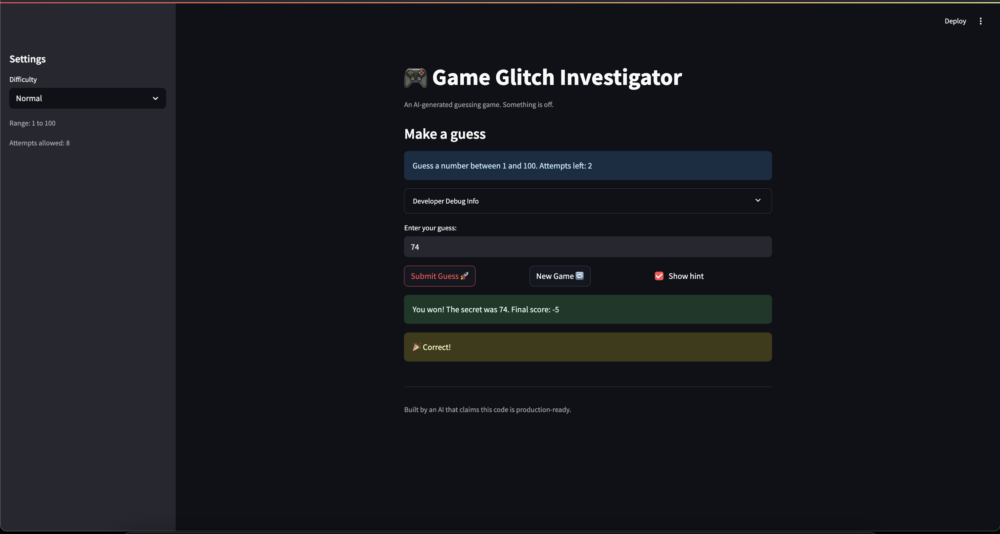

# 🎮 Game Glitch Investigator: The Impossible Guesser

## 🚨 The Situation

You asked an AI to build a simple "Number Guessing Game" using Streamlit.
It wrote the code, ran away, and now the game is unplayable. 

- You can't win.
- The hints lie to you.
- The secret number seems to have commitment issues.

## 🛠️ Setup

1. Install dependencies: `pip install -r requirements.txt`
2. Run the broken app: `python -m streamlit run app.py`

## 🕵️‍♂️ Your Mission

1. **Play the game.** Open the "Developer Debug Info" tab in the app to see the secret number. Try to win.
2. **Find the State Bug.** Why does the secret number change every time you click "Submit"? Ask ChatGPT: *"How do I keep a variable from resetting in Streamlit when I click a button?"*
3. **Fix the Logic.** The hints ("Higher/Lower") are wrong. Fix them.
4. **Refactor & Test.** - Move the logic into `logic_utils.py`.
   - Run `pytest` in your terminal.
   - Keep fixing until all tests pass!

## 📝 Document Your Experience

- [ ] Describe the game's purpose.
This game is a guessing game where you get a set number of chances to correctly guess the secret number. There is an optional hint that will tell you to go higher or lower depending on your guess and if you need to go higher or lower to reach the target. You can reset the game, change the difficulty, and hide the hint.
- [ ] Detail which bugs you found.
Three of the bugs I found:
  1. Game showed me the 7 guesses and asked me for a number. I found that the reccomendation to go lower or higher was randomized. When I was meant to go lower, the app would tell me to go higher instead, and if I typed in the exact same number again, it would decide I should go lower.
  2. Clicking the show hint button hid the hint, and re-clicking it did not make the hint reappear.
  3. Going into easy difficulty reduced my number of guesses down to 6 (or 5?), which was less than normal mode attempts of 8 (or 7?).
- [ ] Explain what fixes you applied.
  I fixed the issue with state from Streamlit by adding a dictionary to hold the state after every rerun. This allowed me to keep the secret number after every action I took like submitting a guess. I also fixed the opposite hint bug where it would tell you to go in the opposite direction of the secret number. This was a simple swap in the if block, and that allowed me to get correct hints after each guess attempt.

## 📸 Demo
     
## 🚀 Stretch Features

- [ ] [If you choose to complete Challenge 4, insert a screenshot of your Enhanced Game UI here]
